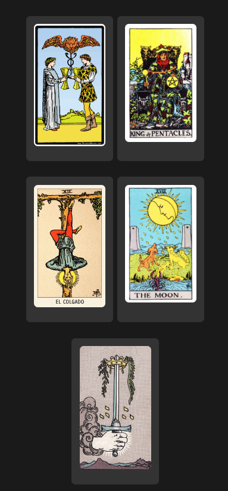
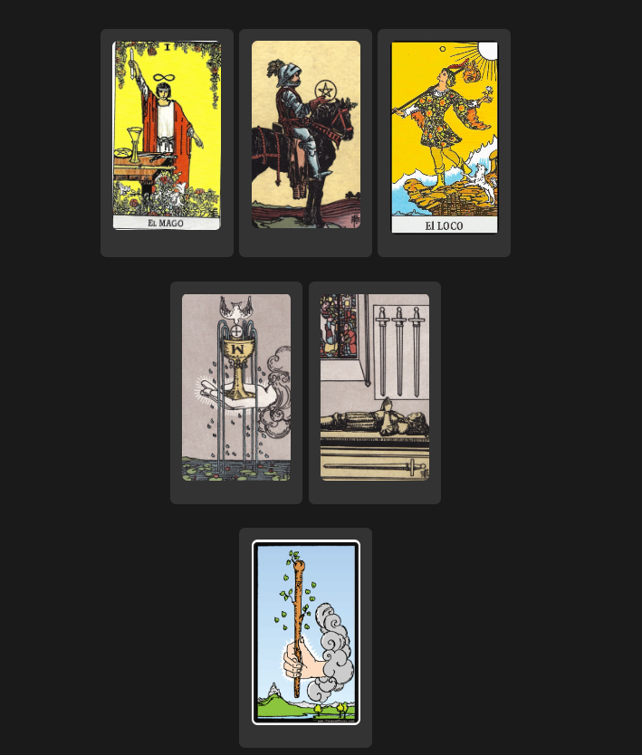
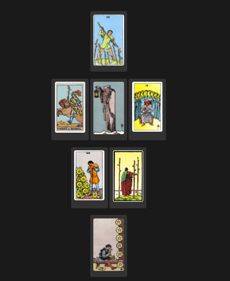
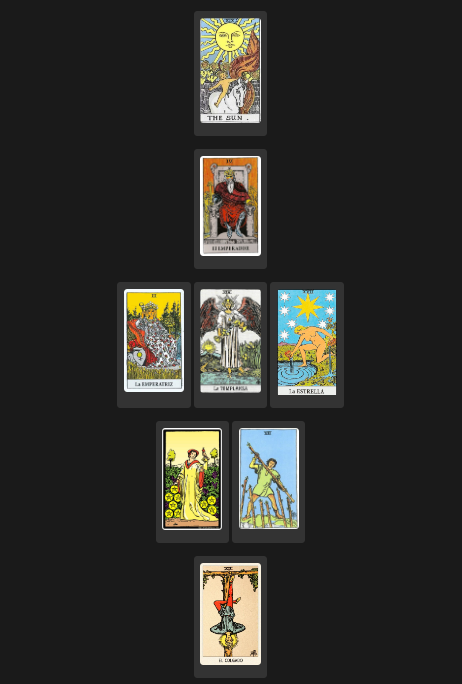

# 🔮 Tarot Canserbero 🔮

Bienvenido a **Tarot Canserbero**, una aplicación web diseñada para la materia [Plataformas Móviles](https://plataformas-moviles.vercel.app/). Este proyecto te permite explorar el fascinante mundo del tarot y obtener respuestas a tus preguntas a través de diferentes tiradas de cartas.

## 🌌 ¿Qué es el tarot?

El tarot te conecta con el universo y con tus guías, quienes te muestran, a través de las cartas, la respuesta a tus preguntas. La tarotista es quien recibe y interpreta estas respuestas.

### Hay 4 opciones de tiradas:

#### 1. ❤️ Tirada Amorosa
La tirada amorosa busca revelar las energías presentes en tus relaciones afectivas, cómo se desarrollarán y qué aspectos debes tener en cuenta para mejorar la conexión con tu pareja o futuras relaciones.
 

#### 2. 🚀 Tirada Nuevo Proyecto
Esta tirada te brinda una perspectiva sobre la viabilidad y el camino a seguir en un nuevo emprendimiento o proyecto, proporcionando claridad sobre los desafíos y las oportunidades que encontrarás.
 

#### 3. 🧙‍♂️ Tirada de Vidas Pasadas
Explora cómo tus experiencias de vidas pasadas influyen en tu presente y descubre patrones o lecciones que podrían estar afectando tu vida actual.
 

#### 4. ☯️ Tirada de Karma
Con esta tirada, podrás comprender mejor las consecuencias de tus acciones pasadas y presentes, ayudándote a equilibrar tu energía y a afrontar de manera más consciente tu destino.
 

---

**ALUMNOS:** Mariano Xavier Gonzalez, Victoria Daniela Blanco
